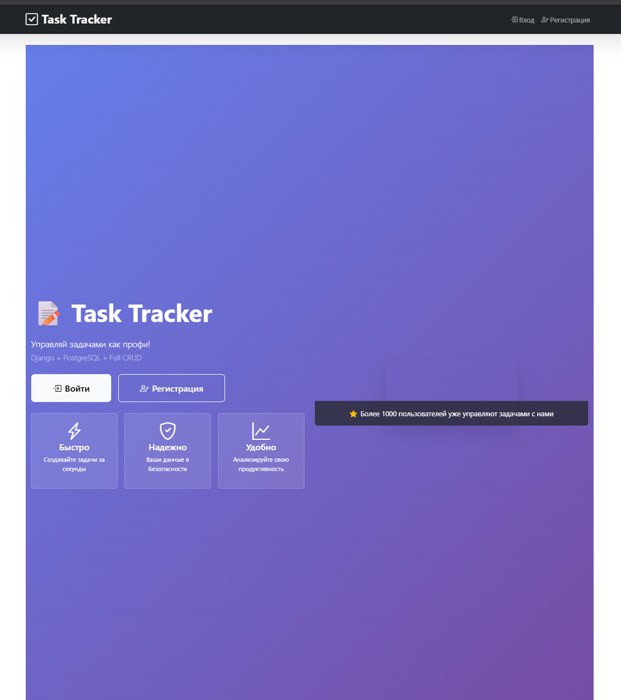
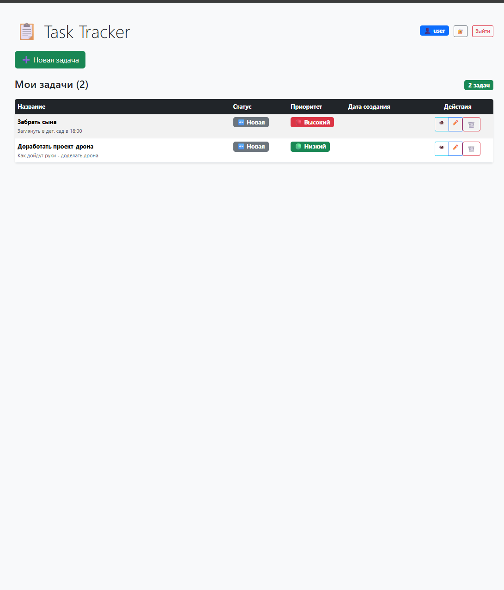
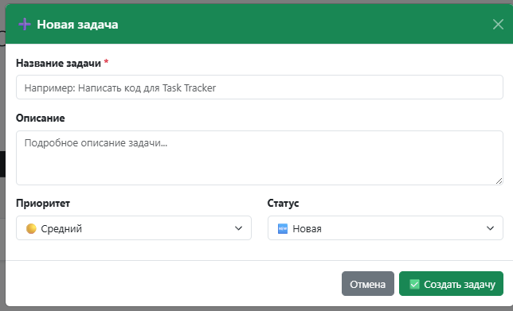

# Планировщик задач Task-Manager на основе Python, Django, PostgreSQL

Этот проект представляет собой простое веб-приложение для отслеживания статуса выполнения задач, взаимодействия с БД, и менеджерингом задач со стороны Администратора.

# Реализованы следующие функции:
- Аутентификация пользователя.  
  Реализована аутентификация пользователей по _email_, _username_, _password_. Данные о пользователях хранятся в СУБД.
  Разграничение доступа к задачам (каждый пользователь видит только свои)
- Создание, обновление, удаление задач (CRUD).  
  Каждую задачу можно создать, придать определенный приоритет, сохранить, отслеживать и изменять, удалять.
- Рабочая Админ-Панель с пользователями и их задачами.
- Docker контейнеризация (Django + PostgreSQL)
  Готово к развертыванию
  Автоматическое создание БД

## Установка
1. Клонируйте репозиторий:
   ```bash
   git clone https://github.com/dader233/Task-Manager.git
   cd Task-Manager
   ```
2. Запуск с DOCKER
   ```bash
   docker-compose up --build # Запуск контейнеров
   docker-compose exec django python manage.py migrate # Применение миграций.
   ```

## Доступ к приложению:
- [http://localhost:8000/](http://localhost:8000/) - Главная страница
- [http://localhost:8000/admin](http://localhost:8000/admin) - Панель Администратора

## Интерфейс
### Стартовая страница с регистрацией и аутентификацией

### Страница с всеми задачами пользователя

### Создание таски(задачи)

_Примечание: Frontend часть (HTML/CSS шаблоны) разработана с использованием AI-ассистентов и Bootstrap._
